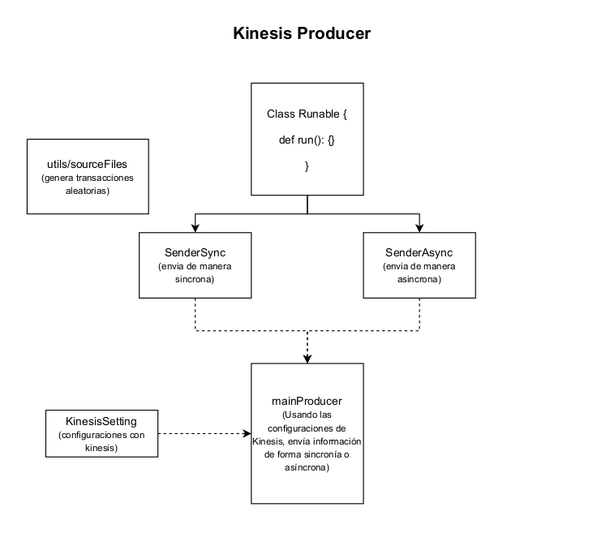
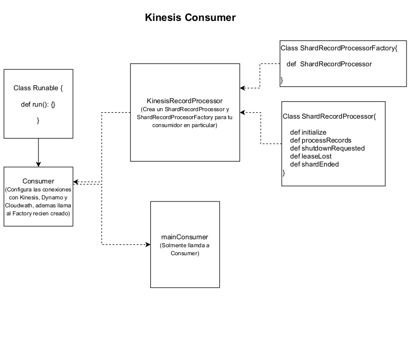

# kinesis-consumer-producer

This repository contains scala code that uses KCL and KPL framework to work with AWS Kinesis.

## KPL structure

```
/src/main
|   KinesisSetting (Kinesis settings)
|   SenderAsync    (Sent messages in a async way) 
|   SenderSync     (Sent messages in a async way) 
|   mainProducer   (Invoke Async/Sync Sender using KinesisSetting)
|   utis/
|   |   sourcerFiles  (Generate random transactions)  

```




## KCL structure

```
/src/main
|   Consumer (Kinesis/Cloudwatch/DynamoDB settings)
|   KinesisRecordProcessor    (Consumer logic) 
|   mainConsumer   (Invoke Consumer)


```


